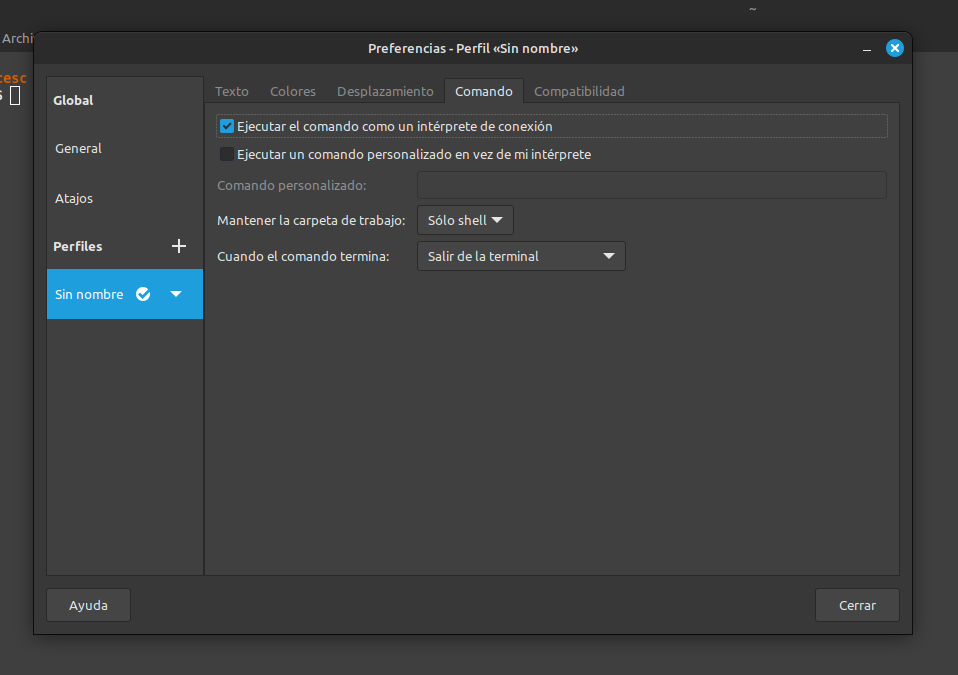

# Personal Dotfiles

Mis dotfiles.

## Instalación

Clone este repo:

```bash
$ cd ~/projects
$ git clone https://github.com/cesc1989/dotfiles
```

Crea un enlace simbólico a la carpeta `$HOME`.

En Linux Mint:

```bash
ln -sv "/home/$(whoami)/projects/dotfiles/runcom/.bash_profile" ~
ln -sv "/home/$(whoami)/projects/dotfiles/git/.gitconfig" ~
ln -sv "/home/$(whoami)/projects/dotfiles/rails/.railsrc" ~
```

En macOS:

```bash
ln -sv "/Users/$(whoami)/projects/dotfiles/runcom/.bash_profile" ~
ln -sv "/Users/$(whoami)/projects/dotfiles/git/.gitconfig" ~
ln -sv "/Users/$(whoami)/projects/dotfiles/rails/.railsrc" ~
```

Añade esto en el archivo `~/.profile`:

```bash
if [ -f "$HOME/.bash_profile" ]; then
  . "$HOME/.bash_profile"
fi
```

## Configuración de Terminal en Linux Mint

La terminal de Linux Mint no lee el archivo `.profile` a menos que se le indique como se muestra en la imagen.



## Zellij

Para [Zellij](https://zellij.dev/documentation/introduction) hay que configurar el archivo `.bashrc` para poder cargar la configuración de mis dotfiles y además hacer un enlace símbolico para los layouts.

### bashrc

Dado a que Zellij no lanza una shell como usuario, hay que cargar la configuración de `.bash_profile` en `.bashrc`.

```bash
if [ -f "$HOME/.bash_profile" ]; then
  . "$HOME/.bash_profile"
fi
```

### Layouts

Asegura que la carpeta `~/.config/zellij/layouts` exista y luego haz un enlace símbolico de los archivos de layouts que están en este proyecto.

En macos:

```bash
ln -sv "/Users/$(whoami)/projects/dotfiles/zellij/layouts/two_panes.kdl" ~/.config/zellij/layouts/two_panes.kdl
ln -sv "/Users/$(whoami)/projects/dotfiles/zellij/layouts/patient_forms.kdl" ~/.config/zellij/layouts/patient_forms.kdl
ln -sv "/Users/$(whoami)/projects/dotfiles/zellij/layouts/therapist_signup.kdl" ~/.config/zellij/layouts/therapist_signup.kdl
ln -sv "/Users/$(whoami)/projects/dotfiles/zellij/layouts/dashboard_edge_marketplace.kdl" ~/.config/zellij/layouts/dashboard_edge_marketplace.kdl
```

## Hammerspoon - Solo macOS

Necesario tener instalado [Karabiner-Elements](https://github.com/pqrs-org/Karabiner-Elements) y [Hammerspoon](http://www.hammerspoon.org/).

Esta es una herramienta para atajos de teclado mediante scripts escritos en Lua.

Para activarlos hay que acer el enlace simbólico:

```bash
ln -sv "/Users/$(whoami)/projects/dotfiles/hammerspoon/init.lua" ~/.hammerspoon/init.lua
```

## Enlaces

Tomé ideas de estos otros:

- [Tute](https://github.com/tute/dotfiles)
- [Pedro Fernandez](https://github.com/pedrofernandezm/dotfiles)
- [Web Pro](https://github.com/webpro/dotfiles)
- [Mathias Bynens](https://github.com/mathiasbynens/dotfiles)
